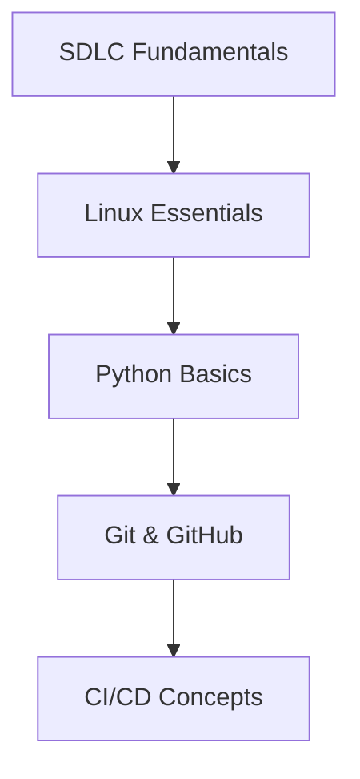

<h1 align="center">👋 Hi, I'm Shaik Kalandar</h1>
<h3 align="center">Cloud Automation Specialist | DevOps Mentor</h3>

<div align="center">
  
</div>

---

## 📌 About Me

I'm a cloud infrastructure specialist passionate about creating automation solutions and mentoring aspiring DevOps engineers. With **200+ hours of 1:1 mentorship experience**, I've helped 50+ students transition into cloud engineering roles through practical, hands-on training.

**Core Expertise:**  
`Infrastructure as Code` • `CI/CD Pipelines` • `Cloud Security` • `Container Orchestration`

---

## 🏆 Certifications

[](https://learn.microsoft.com/api/credentials/share/en-us/ShaikKalandar-4032/CF5B4B9D6E4A3D84?sharingId=9D5D3A3289D8D5A4)
[](https://learn.microsoft.com/api/credentials/share/en-us/ShaikKalandar-4032/CF5B4B9D6E4A3D84?sharingId=9D5D3A3289D8D5A4)
[](https://learn.microsoft.com/api/credentials/share/en-us/ShaikKalandar-4032/CF5B4B9D6E4A3D84?sharingId=9D5D3A3289D8D5A4)
[](https://www.credly.com/badges/1e3a3b9a-5b3a-4b3a-9b3a-5b3a4b3a9b3a)

---

## 📊 Activity Metrics

<div align="center">
  <a href="https://git.io/streak-stats">
    
  </a>
  <br>
  
  
</div>

---

## 🧭 Learning Pathways

### 🚀 Beginner's Journey


| Resource | Description | Time Investment |
|----------|-------------|-----------------|
| [SDLC Guide](https://github.com/kala-techies/sdlc-fundamentals) | Software development lifecycle fundamentals | 10 hours |
| [Linux Starter](https://github.com/kala-techies/linuxStarter) | Practical Linux administration course | 15 hours |
| [Python Primer](https://github.com/kala-techies/MLOPS/tree/main/Section03PythonEssentials) | Core programming concepts & automation | 20 hours |

---

## 🏗️ Professional Projects

| Project | Tech Stack | Key Feature |
|---------|------------|-------------|
| [Blog Deployment](https://github.com/kala-techies/kalandar-blog) | React + Docker | Production-grade containerization |
| [Cricket API Clone](https://github.com/kala-techies/cricbuzz_clone) | Flask + Docker | Real-time data pipelines |
| [Azure Automation](https://github.com/kala-techies/azure-terraform-vm-deployment) | Terraform + GitHub Actions | Enterprise IaC templates |
| [PowerShell Toolkit](https://github.com/kala-techies/PowershellBy_Kala) | PowerShell + Azure | Operational automation scripts |

---

## 🌐 Connect With Me

<div align="center">
  <a href="https://www.linkedin.com/in/shaik-kalandar-b86208332">
    
  </a>
  <a href="https://kala-techies.my.canva.site/">
    
  </a>
  <a href="mailto:connectwithkala18@gmail.com">
    
  </a>
  <a href="https://staging2.topmate.io/kala/">
    
  </a>
</div>

---

## 🛣️ Roadmap Ahead

**Q4 2024**  
🔹 Azure Networking Deep Dive  
🔹 Advanced Security Groups Configuration  

**2025**  
🔸 AWS Security Architecture  
🔸 AI-Driven Infrastructure Optimization  

---

<p align="center">
  <em>"Automation is the bridge between ideas and execution - let's build remarkable solutions!"</em> 🚀
</p>
```