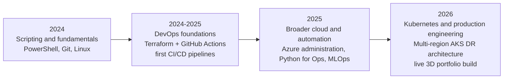
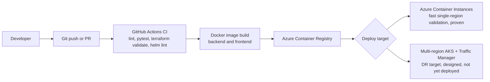

<a href="https://www.linkedin.com/in/shaik-kalandar-b86208332">LinkedIn</a> ·
<a href="https://kala-techies.github.io/">Portfolio</a> ·
<a href="mailto:connectwithkala18@gmail.com">Email</a> ·
<a href="https://staging2.topmate.io/kala/">Mentorship</a>

I build cloud infrastructure, automate the pipelines that ship it, and document the decisions behind both. Most of what's below is Azure and Kubernetes work; a couple of applied-AI and frontend projects sit alongside it as things I build for the same reason — because I wanted to see if I could make them work end to end.

---

### What I build

|  |  |
|---|---|
| ☁️ **Cloud Infrastructure** | Provisioning Azure resources with Terraform instead of the portal — networking, compute, managed databases. |
| ☸️ **Kubernetes / AKS** | A multi-region AKS architecture with automatic failover, designed and validated module-by-module against real Azure constraints. |
| 🚀 **DevOps & CI/CD** | GitHub Actions pipelines that lint, test, build containers, and validate infrastructure code on every push. |
| 🏗️ **Infrastructure as Code** | Terraform modules written to be read and reused, not one-off scripts. |
| 📊 **Reliability & DR** | Failover design, RTO/RPO methodology, and a written runbook for the day something actually goes down. |
| 🤖 **Automation** | Scripting the repetitive parts of ops work in Python and PowerShell so they stop being repetitive. |

---

### Engineering journey

```mermaid
graph LR
    A["2024<br/>Scripting and fundamentals<br/>PowerShell, Git, Linux"] --> B["2024-2025<br/>DevOps foundations<br/>Terraform + GitHub Actions<br/>first CI/CD pipelines"]
    B --> C["2025<br/>Broader cloud and automation<br/>Azure administration, Python for Ops, MLOps"]
    C --> D["2026<br/>Kubernetes and production engineering<br/>Multi-region AKS DR architecture<br/>live 3D portfolio build"]
```

This isn't a resume timeline — it's the order these repositories were actually created in. Each stage is still active; the guides from 2024 are still maintained, the AKS project is this month's work.

---

### Start here

If you only look at three things:

→ **[aks-multi-region-dr](https://github.com/kala-techies/aks-multi-region-dr)** — the flagship. A real 3-tier app, Terraform + Helm for a multi-region AKS disaster-recovery architecture, and a documented decision log for every non-default choice.
→ **[kala-techies.github.io](https://github.com/kala-techies/kala-techies.github.io)** — a live 3D portfolio (React Three Fiber), built and deployed through its own GitHub Actions pipeline.
→ **[sdlc-fundamentals](https://github.com/kala-techies/sdlc-fundamentals)** — the most-starred of the technical guides, for a sense of how I explain engineering concepts to other people.

---

### Featured engineering work

#### ☁️ Cloud, Kubernetes & DevOps — professional focus

**[aks-multi-region-dr](https://github.com/kala-techies/aks-multi-region-dr)**
A disaster-recovery reference architecture on Azure, built around a real three-tier app (static frontend, FastAPI backend, PostgreSQL) rather than a toy example.
- **Stack:** Terraform (network / AKS / ACR / PostgreSQL / Traffic Manager modules), Helm, FastAPI, GitHub Actions (CI + gated CD), Docker
- **Status, honestly:** the single-region path has been deployed to real Azure infrastructure via Container Instances, verified reachable from outside Azure, then torn down. The multi-region **AKS** architecture — the actual DR target — is written and validated (`terraform validate`, `helm lint` run in CI) but not yet deployed, blocked on a region restriction on the current subscription, tracked openly in the repo's decision log.
- **Why it matters:** it's the one repo here that documents *why*, not just *what* — an architecture doc, a numbered ADR log with alternatives considered, a cost analysis, and a DR runbook.

**[azure-terraform-vm-deployment](https://github.com/kala-techies/azure-terraform-vm-deployment)**
Terraform modules (`vnet.tf`, `nsg.tf`, `vm.tf`) plus a GitHub Actions workflow that runs `init` → `plan` → `apply` against Azure on push. One-command VM provisioning from CI, credentials handled via GitHub Secrets.

**[DockerGithubActionsDeployment](https://github.com/kala-techies/DockerGithubActionsDeployment)**
A Flask app with a full build → test (pytest) → containerize (Docker) → push pipeline in GitHub Actions. The smallest repo here, and the cleanest example of a working CI/CD loop end to end.

#### 🧭 Technical guides & mentorship

400+ hours of hands-on DevOps training delivered. Alongside that, these guides have picked up real usage from other learners — star counts are other engineers, not vanity metrics:

| Guide | What it covers | Stars |
|---|---|---|
| [SDLC Fundamentals](https://github.com/kala-techies/sdlc-fundamentals) | Planning through deployment, phase by phase | 17★ |
| [Terraform with Azure](https://github.com/kala-techies/TerraformWithAzure) | Step-by-step IaC for Azure resources | 15★ |
| [GitForOps](https://github.com/kala-techies/GitForOps) | Day-wise Git tutorial, foundational → advanced | 9★ |
| [MLOps Pipeline](https://github.com/kala-techies/MLOPS) *(in progress)* | ML + DevOps workflow fundamentals | 8★ |
| [Linux Starter](https://github.com/kala-techies/linuxStarter) | Command-line foundations | 5★ |
| [CloudControl with Azure](https://github.com/kala-techies/CloudControl-with-Azure) | Azure administration, hands-on labs | 4★ |
| [PythonForOps](https://github.com/kala-techies/PythonForOps) | Python for automation & ops scripting | — |

These are teaching material, presented as such — not billed as production systems.

#### 🎨 Personal & frontend

**[kala-techies.github.io](https://github.com/kala-techies/kala-techies.github.io)** — a 3D "cloud command center" portfolio site (React + TypeScript + React Three Fiber, Tailwind, Framer Motion), deployed via its own GitHub Actions workflow. Live at [kala-techies.github.io](https://kala-techies.github.io/).

**[Vehicle UI Dashboard](https://github.com/kala-techies/vehicle-ui-dashboard)** — a component-driven React + Nx + Storybook dashboard, built to practice a proper monorepo CI/CD setup deploying to GitHub Pages. [Live demo](https://kala-techies.github.io/vehicle-ui-dashboard/).

**[Map Your Journey](https://github.com/kala-techies/map-your-journey)** — a React + Leaflet travel tracker for places visited across India, localStorage-backed, no server. [Live demo](https://kala-techies.github.io/map-your-journey/).

#### 🤖 Applied AI — secondary exploration

**OfflineMoMAI** *(private repo — happy to walk through the code on request)*
A fully offline meeting assistant for Android: on-device speech transcription (whisper.cpp), on-device LLM summarization (llama.cpp, Qwen2.5-1.5B-Instruct), and a real-time offline translator across English and nine Indian languages. No cloud calls, no accounts. Built with Flutter/Dart, Riverpod, and a Clean Architecture split (domain/data/presentation).

This exists because I wanted to see how far infrastructure-style thinking — clean boundaries, no hidden dependencies, everything reproducible — holds up outside the cloud. It's not the direction my professional work is headed; it's evidence the same habits transfer.

---

### How I think about systems

The pipeline behind `aks-multi-region-dr`, as it's actually configured today — not aspirational:

```mermaid
flowchart LR
    Dev["Developer"] --> Git["Git push or PR"]
    Git --> CI["GitHub Actions CI<br/>lint, pytest, terraform validate, helm lint"]
    CI --> Build["Docker image build<br/>backend and frontend"]
    Build --> Reg["Azure Container Registry"]
    Reg --> Deploy{"Deploy target"}
    Deploy --> ACI["Azure Container Instances<br/>fast single-region validation, proven"]
    Deploy --> AKS["Multi-region AKS + Traffic Manager<br/>DR target, designed, not yet deployed"]
```

No step here is a security-scanning gate — that's deliberate. The repo carries a written security review (`docs/security-review.md`) and a documented region/quota constraint discovered by direct testing against the subscription (`DECISIONS.md`); neither is an automated check yet, and I'd rather show the pipeline as it runs than round it up.

---

### Technical arsenal

Grouped by what's actually backed by a repo above, plus the broader toolset from hands-on training and certification work.

**Cloud** — Azure · AWS · GCP
**Containers & Orchestration** — Docker · Kubernetes · AKS
**Infrastructure as Code** — Terraform · Helm
**CI/CD** — GitHub Actions
**Automation** — Python · Bash · PowerShell
**Security & compliance tooling** *(trained on, not yet wired into a public pipeline)* — SonarQube · Snyk · Trivy · Black Duck
**Applied AI / Mobile** — Flutter · Dart · Riverpod · llama.cpp · whisper.cpp
**Core** — MSSQL · Networking

---

### Certifications & education

- Microsoft Certified: Azure Fundamentals (AZ-900)
- Microsoft Certified: Azure AI Fundamentals (AI-900)
- Microsoft Certified: Azure Network Engineer Associate (AZ-700)
- HashiCorp Certified: Terraform Associate
- [Verify Microsoft certifications →](https://learn.microsoft.com/en-us/users/shaikkalandar-4032/)

Post Graduation in MSc Computer Science — Acharya Nagarjuna University

---

### By the numbers

26 public repositories · 58★ across technical guides · 400+ hours of DevOps training delivered · one AKS multi-region DR architecture currently in progress, in the open.

---

### Let's build something

Open to Cloud/DevOps engineering roles, Kubernetes and infrastructure automation work, and mentorship collaborations.

<a href="https://github.com/kala-techies">GitHub</a> ·
<a href="https://www.linkedin.com/in/shaik-kalandar-b86208332">LinkedIn</a> ·
<a href="https://kala-techies.github.io/">Portfolio</a> ·
<a href="mailto:connectwithkala18@gmail.com">Email</a>

