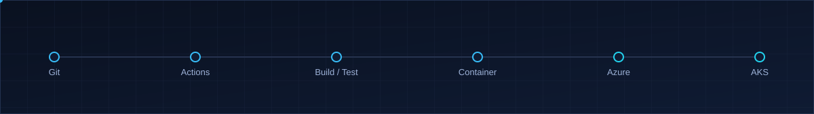

Building and automating reliable cloud infrastructure across Azure, Kubernetes and modern DevOps pipelines.

<a href="https://kala-techies.github.io/">Portfolio</a> ·
<a href="https://www.linkedin.com/in/shaik-kalandar-b86208332">LinkedIn</a> ·
<a href="mailto:connectwithkala18@gmail.com">Email</a>

---

### What I do

**Cloud Infrastructure** → Design and automate Azure resources with Terraform
**Kubernetes / AKS** → Multi-region container orchestration and platform design
**DevOps** → CI/CD pipelines and repeatable delivery
**Infrastructure as Code** → Reusable, version-controlled Terraform modules
**Reliability** → Failover design, runbooks, honest status reporting

---

### Proof of work

**[aks-multi-region-dr](https://github.com/kala-techies/aks-multi-region-dr)** — Multi-region AKS disaster-recovery architecture on Azure. Single-region path proven live; multi-region AKS path designed and validated.
`Terraform · Kubernetes · Helm · GitHub Actions`

**[azure-terraform-vm-deployment](https://github.com/kala-techies/azure-terraform-vm-deployment)** — Terraform + GitHub Actions pipeline that provisions Azure VMs on every push.
`Terraform · Azure · CI/CD`

**[DockerGithubActionsDeployment](https://github.com/kala-techies/DockerGithubActionsDeployment)** — Build → test → containerize → deploy pipeline for a Flask app, fully automated.
`Docker · GitHub Actions · Python`

**[kala-techies.github.io](https://github.com/kala-techies/kala-techies.github.io)** — Live 3D portfolio, built and deployed through its own CI/CD pipeline.
`React · TypeScript · GitHub Actions` · [Live](https://kala-techies.github.io/)

---

### Technology signal

Cloud → Azure
Containers → Docker, Kubernetes, AKS
IaC → Terraform
CI/CD → GitHub Actions
Automation → Python, Bash, PowerShell

I also document and share practical DevOps/cloud knowledge through open repositories.

26 public repositories · 400+ hours of DevOps mentoring · AZ-900 · AI-900 · AZ-700 · Terraform Associate

---

Interested in Cloud / DevOps / Platform Engineering or engineering collaboration? Let's connect.

<a href="https://www.linkedin.com/in/shaik-kalandar-b86208332">LinkedIn</a> |
<a href="https://kala-techies.github.io/">Portfolio</a> |
<a href="mailto:connectwithkala18@gmail.com">Email</a>

