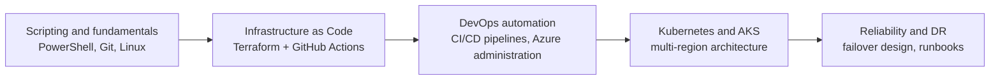
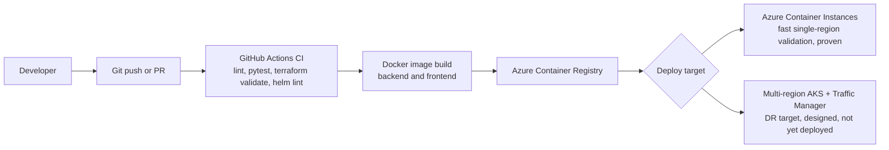

<h3>
<a href="https://kala-techies.github.io/">Portfolio</a> &nbsp;·&nbsp;
<a href="https://www.linkedin.com/in/shaik-kalandar-b86208332">LinkedIn</a> &nbsp;·&nbsp;
<a href="https://github.com/kala-techies">GitHub</a> &nbsp;·&nbsp;
<a href="mailto:connectwithkala18@gmail.com">Email</a> &nbsp;·&nbsp;
<a href="https://staging2.topmate.io/kala/">Mentorship</a>
</h3>

### Who I am

I'm a Cloud & DevOps engineer. I provision Azure infrastructure with Terraform, wire it into GitHub Actions pipelines, and — this year — have been building out a multi-region AKS disaster-recovery architecture from the ground up. A couple of applied-AI and frontend projects sit alongside that work, kept clearly secondary: they're evidence the same engineering habits transfer, not a second identity.

Everything below is drawn from what's actually in these repositories — real workflow files, real Terraform, real deployment history — not from a skills list.

---

### What I build

|  |  |
|---|---|
| ☁️ **Azure & Cloud Infrastructure** | Provisioning Azure resources with Terraform instead of the portal — networking, compute, managed databases. [`azure-terraform-vm-deployment`](https://github.com/kala-techies/azure-terraform-vm-deployment) |
| ☸️ **Kubernetes / AKS** | A multi-region AKS architecture with automatic failover, designed and validated module-by-module against real Azure constraints. [`aks-multi-region-dr`](https://github.com/kala-techies/aks-multi-region-dr) |
| ⚙️ **DevOps & CI/CD** | GitHub Actions pipelines that lint, test, build containers, and validate infrastructure code on every push. [`DockerGithubActionsDeployment`](https://github.com/kala-techies/DockerGithubActionsDeployment) |
| 🏗️ **Infrastructure as Code** | Terraform modules written to be read and reused, not one-off scripts. [`aks-multi-region-dr`](https://github.com/kala-techies/aks-multi-region-dr) |
| ♻️ **Reliability / DR** | Failover design, RTO/RPO methodology, and a written runbook for the day something actually goes down. [`aks-multi-region-dr`](https://github.com/kala-techies/aks-multi-region-dr) |
| 🤖 **Automation** | Scripting the repetitive parts of ops work in Python and PowerShell so they stop being repetitive. [`PythonForOps`](https://github.com/kala-techies/PythonForOps) |

*Security tooling (SonarQube, Snyk, Trivy, Black Duck) is trained on but not yet wired into a public pipeline — called out honestly rather than implied.*

---

### Engineering journey

```mermaid
graph LR
    A["Scripting and fundamentals<br/>PowerShell, Git, Linux"] --> B["Infrastructure as Code<br/>Terraform + GitHub Actions"]
    B --> C["DevOps automation<br/>CI/CD pipelines, Azure administration"]
    C --> D["Kubernetes and AKS<br/>multi-region architecture"]
    D --> E["Reliability and DR<br/>failover design, runbooks"]
```

Not a resume timeline — this is the actual order these repositories were created in, from earliest scripting work through this month's AKS project. Every stage is still active; nothing here was retired to make room for the next one.

---

### Flagship engineering work

<table>
<tr><td>

#### [aks-multi-region-dr](https://github.com/kala-techies/aks-multi-region-dr)

A disaster-recovery reference architecture on Azure, built around a real three-tier application (static frontend, FastAPI backend, PostgreSQL) instead of a toy example.

**Stack:** Terraform (network / AKS / ACR / PostgreSQL / Traffic Manager modules) · Helm · FastAPI · GitHub Actions (CI + gated CD) · Docker

**Status, honestly:** the single-region path has been deployed to real Azure infrastructure via Container Instances, verified reachable from outside Azure, then torn down. The multi-region **AKS** architecture — the actual DR target — is written and validated (`terraform validate`, `helm lint` run in CI) but not yet deployed, blocked on a region restriction on the current subscription. That blocker is tracked openly, not hidden, in the repo's own decision log.

**Why it's the flagship:** it's the only repo here that documents *why*, not just *what* — an architecture doc, a numbered ADR log with alternatives considered and rejected, a cost analysis, and a DR runbook. It's also this month's work, not something coasting on age.

</td></tr>
</table>

---

### Cloud, AKS & DevOps

**[azure-terraform-vm-deployment](https://github.com/kala-techies/azure-terraform-vm-deployment)**
Terraform modules (`vnet.tf`, `nsg.tf`, `vm.tf`) plus a GitHub Actions workflow that runs `init` → `plan` → `apply` against Azure on push. One-command VM provisioning from CI, credentials handled via GitHub Secrets.

**[DockerGithubActionsDeployment](https://github.com/kala-techies/DockerGithubActionsDeployment)**
A Flask app with a full build → test (pytest) → containerize (Docker) → push pipeline in GitHub Actions. The smallest repo here, and the cleanest example of a working CI/CD loop end to end.

---

### Automation, IaC & reliability

The Terraform modules above are written to be reused across environments, not copy-pasted per project — see the `terraform/modules/` split in `aks-multi-region-dr`. Ops scripting is covered separately in [`PythonForOps`](https://github.com/kala-techies/PythonForOps) (Python for automation) and [`PowershellBy_Kala`](https://github.com/kala-techies/PowershellBy_Kala) (in progress). Reliability and disaster-recovery thinking — RTO/RPO methodology, failover design, a written runbook — lives in `aks-multi-region-dr`'s `docs/` folder rather than as a standalone project; it's a discipline applied to that architecture, not yet a separate body of work.

---

### Architecture

The pipeline behind `aks-multi-region-dr`, as it's actually configured today — not aspirational:

```mermaid
flowchart LR
    Dev["Developer"] --> Git["Git push or PR"]
    Git --> CI["GitHub Actions CI<br/>lint, pytest, terraform validate, helm lint"]
    CI --> Build["Docker image build<br/>backend and frontend"]
    Build --> Reg["Azure Container Registry"]
    Reg --> Deploy{"Deploy target"}
    Deploy --> ACI["Azure Container Instances<br/>fast single-region validation, proven"]
    Deploy --> AKS["Multi-region AKS + Traffic Manager<br/>DR target, designed, not yet deployed"]
```

No step here is a security-scanning gate — that's deliberate. The repo carries a written security review (`docs/security-review.md`) and a documented region/quota constraint discovered by direct testing against the subscription (`DECISIONS.md`); neither is an automated check yet, and I'd rather show the pipeline as it runs than round it up.

---

### Cloud & DevOps stack

Grouped by what's actually backed by a repo above — not a flat badge wall.

**Cloud**
Azure · AWS · GCP

**Containers & Orchestration**
Docker · Kubernetes · AKS

**Infrastructure as Code**
Terraform · Helm

**CI/CD**
GitHub Actions

**Automation**
Python · Bash · PowerShell

**Security & compliance** *(trained on, not yet wired into a public pipeline)*
SonarQube · Snyk · Trivy · Black Duck

**Applied AI / Mobile**
Flutter · Dart · Riverpod · llama.cpp · whisper.cpp

**Core**
MSSQL · Networking

---

### Knowledge & mentorship

400+ hours of hands-on DevOps training delivered. I don't just learn these tools — I document and teach them, and these guides have picked up real usage from other learners:

| Guide | What it covers | Stars |
|---|---|---|
| [SDLC Fundamentals](https://github.com/kala-techies/sdlc-fundamentals) | Planning through deployment, phase by phase | 17★ |
| [Terraform with Azure](https://github.com/kala-techies/TerraformWithAzure) | Step-by-step IaC for Azure resources | 15★ |
| [GitForOps](https://github.com/kala-techies/GitForOps) | Day-wise Git tutorial, foundational → advanced | 9★ |
| [MLOps Pipeline](https://github.com/kala-techies/MLOPS) *(in progress)* | ML + DevOps workflow fundamentals | 8★ |
| [Linux Starter](https://github.com/kala-techies/linuxStarter) | Command-line foundations | 5★ |
| [CloudControl with Azure](https://github.com/kala-techies/CloudControl-with-Azure) | Azure administration, hands-on labs | 4★ |
| [PythonForOps](https://github.com/kala-techies/PythonForOps) | Python for automation & ops scripting | — |

These are teaching material, presented as such — not billed as production systems. (A handful of other repos in my forks tab — Git/DevOps/Argo CD example projects — are things I forked to learn from, not original work, so they're left out of this list on purpose.)

---

### Personal & experimental

Secondary to the Cloud/DevOps work above, kept in its own lane so it doesn't dilute it.

**[kala-techies.github.io](https://github.com/kala-techies/kala-techies.github.io)** — a 3D "cloud command center" portfolio site (React + TypeScript + React Three Fiber, Tailwind, Framer Motion), deployed via its own GitHub Actions workflow. Live at [kala-techies.github.io](https://kala-techies.github.io/).

**[Vehicle UI Dashboard](https://github.com/kala-techies/vehicle-ui-dashboard)** — a component-driven React + Nx + Storybook dashboard, built to practice a proper monorepo CI/CD setup deploying to GitHub Pages. [Live demo](https://kala-techies.github.io/vehicle-ui-dashboard/).

**[Map Your Journey](https://github.com/kala-techies/map-your-journey)** — a React + Leaflet travel tracker for places visited across India, localStorage-backed, no server. [Live demo](https://kala-techies.github.io/map-your-journey/).

**OfflineMoMAI** *(private repo — happy to walk through the code on request)* — a fully offline meeting assistant for Android: on-device speech transcription (whisper.cpp), on-device LLM summarization (llama.cpp, Qwen2.5-1.5B-Instruct), and a real-time offline translator across English and nine Indian languages. No cloud calls, no accounts. Built with Flutter/Dart, Riverpod, and a Clean Architecture split (domain/data/presentation). It exists because I wanted to see how far infrastructure-style thinking — clean boundaries, no hidden dependencies, everything reproducible — holds up outside the cloud. It isn't the direction my professional work is headed.

---

### Certifications & education

- Microsoft Certified: Azure Fundamentals (AZ-900)
- Microsoft Certified: Azure AI Fundamentals (AI-900)
- Microsoft Certified: Azure Network Engineer Associate (AZ-700)
- HashiCorp Certified: Terraform Associate
- [Verify Microsoft certifications →](https://learn.microsoft.com/en-us/users/shaikkalandar-4032/)

Post Graduation in MSc Computer Science — Acharya Nagarjuna University

---

26 public repositories · 58★ across technical guides · 400+ hours of DevOps training delivered · one AKS multi-region DR architecture currently in progress, in the open.

---

### Let's build something

Open to Cloud/DevOps engineering roles, Kubernetes and infrastructure automation work, and mentorship collaborations.

<a href="mailto:connectwithkala18@gmail.com">Email</a> ·
<a href="https://www.linkedin.com/in/shaik-kalandar-b86208332">LinkedIn</a> ·
<a href="https://kala-techies.github.io/">Portfolio</a>

